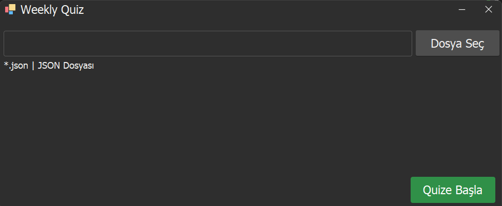

# QuizApp

**QuizApp**, kullanıcıların kelimeleri ve anlamlarını öğrenebileceği ve test edebileceği bir uygulamadır. Uygulama, JSON formatında bir dosya kullanarak kelimelerle ilgili veri yükler ve bu kelimeleri rastgele bir şekilde gösterir. Kullanıcı, kelimenin anlamını doğru yazarak ilerler. Her doğru cevap sonrasında bir sonraki kelime yüklenir.




## Özellikler
- **Kelime Öğrenme**: Kullanıcılar verilen kelimelerin anlamlarını öğrenir.
- **Rastgele Kelime Gösterimi**: Kelimeler rastgele gösterilir.
- **Renkli Arayüz**: Kelime gösterimi sırasında arka plan renkleri rastgele değişir.
- **JSON Formatında Veri Yükleme**: Kelimeler ve anlamlar bir JSON dosyasından yüklenebilir. Kelimeler ve anlamlar, virgülle ayrılmış anlamlı çiftler olarak JSON dosyasına eklenebilir.
- **İpucu Özelliği**: Her tıklamada kelimenin anlamının harfleri sırasıyla gösterilir. İlk tıklamada tüm harfler gizlenir, ikinci tıklamada ilk harf görünür, sonrasında her tıklamada bir sonraki harf açılır.
- **Soru ve Cevap Doğrulama**: Kullanıcı, kelimenin anlamını doğru yazarak ilerler. Doğru cevap sonrası bir sonraki kelime gösterilir.
- **Kelimeler Arası Geçiş**: Her doğru cevap sonrası bir sonraki kelime otomatik olarak yüklenir.

## Teknolojiler
- **DevExpress WinForms**: Uygulama, DevExpress'in görsel bileşenlerini kullanarak geliştirildi.
- **C#**: Uygulamanın ana dili C#'tır.
- **JSON**: Verilerin saklanması ve yüklenmesi için JSON formatı kullanılır.

## Kurulum

### Gereksinimler
- **Microsoft .NET Framework**: Bu proje, .NET Framework ile geliştirilmiştir. Uygulamayı çalıştırmak için .NET Framework'ün yüklü olması gerekmektedir.
- **DevExpress**: DevExpress WinForms bileşenleri bu projede kullanılmıştır. DevExpress'in gerekli sürümünü yüklemeniz gerekebilir.

### Adımlar
1. **Projeyi İndirin veya Klonlayın**
   Bu projeyi GitHub üzerinden indirebilir veya klonlayabilirsiniz:
   ```bash
   git clone https://github.com/username/QuizApp.git
   ```

## Veri Formatı

Proje içerisinde örnek veri olarak `example-data.json` dosyası bulunmaktadır. JSON veri formatı aşağıdaki yapıda olmalıdır:

```json
{
  "words": [
    {
      "word": "achievement",
      "meaning": "başarı"
    },
    {
      "word": "advantage",
      "meaning": "avantaj"
    },
    {
      "word": "agreement",
      "meaning": "anlaşma"
    },
    {
      "word": "attention",
      "meaning": "dikkat"
    },
    {
      "word": "behavior",
      "meaning": "davranış"
    },
    {
      "word": "challenge",
      "meaning": "zorluk"
    },
    {
      "word": "choice",
      "meaning": "seçim"
    },
    {
      "word": "community",
      "meaning": "toplum"
    },
    {
      "word": "confidence",
      "meaning": "özgüven"
    },
    {
      "word": "contribution",
      "meaning": "katkı"
    },
    {
      "word": "decision",
      "meaning": "karar"
    },
    {
      "word": "development",
      "meaning": "gelişim"
    },
    {
      "word": "difference",
      "meaning": "farklılık"
    },
    {
      "word": "education",
      "meaning": "eğitim"
    },
    {
      "word": "experience",
      "meaning": "deneyim"
    },
    {
      "word": "freedom",
      "meaning": "özgürlük"
    },
    {
      "word": "goal",
      "meaning": "hedef"
    },
    {
      "word": "growth",
      "meaning": "büyüme"
    },
    {
      "word": "idea",
      "meaning": "fikir"
    },
    {
      "word": "influence",
      "meaning": "etki"
    },
    {
      "word": "knowledge",
      "meaning": "bilgi"
    },
    {
      "word": "language",
      "meaning": "dil"
    },
    {
      "word": "leadership",
      "meaning": "liderlik"
    },
    {
      "word": "opinion",
      "meaning": "görüş"
    },
    {
      "word": "opportunity",
      "meaning": "fırsat"
    },
    {
      "word": "responsibility",
      "meaning": "sorumluluk"
    },
    {
      "word": "safety",
      "meaning": "güvenlik"
    },
    {
      "word": "success",
      "meaning": "başarı"
    },
    {
      "word": "support",
      "meaning": "destek"
    },
    {
      "word": "team",
      "meaning": "takım"
    },
    {
      "word": "trust",
      "meaning": "güven"
    },
    {
      "word": "value",
      "meaning": "değer"
    },
    {
      "word": "vision",
      "meaning": "vizyon"
    },
    {
      "word": "volunteer",
      "meaning": "gönüllü"
    },
    {
      "word": "work",
      "meaning": "çalışma"
    }
  ]
}
```

Her kelime çifti `word` (İngilizce kelime) ve `meaning` (Türkçe anlamı) alanlarından oluşur. Yeni kelimeler eklemek için bu formatı takip ederek JSON dosyasını genişletebilirsiniz.
